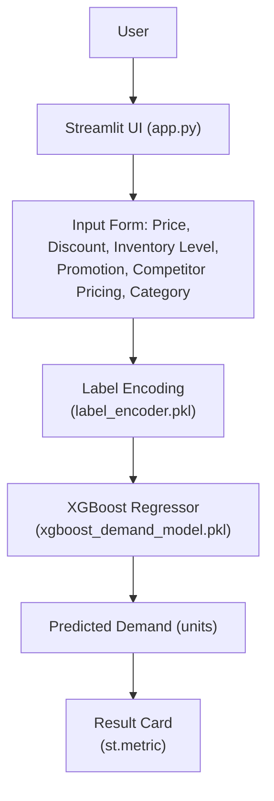
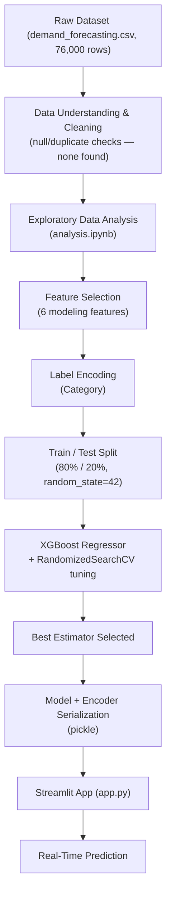

# 📊 Demand Forecasting System

> A machine learning application that predicts product demand from pricing, promotion, inventory, and competitor-pricing signals, served through an interactive Streamlit interface.

[](https://github.com/harshantla-cloud/Demand-Forecasting-System)
[](https://www.python.org/)
[](https://streamlit.io/)
[](https://xgboost.readthedocs.io/)

Retailers routinely over- or under-stock products because demand is estimated by intuition rather than data. This project trains a gradient-boosted regression model on 76,000 historical sales records and exposes it through a lightweight web app, so a user can enter a product's price, discount, inventory level, promotion status, and category and get an instant demand forecast in units. It's built for retail/inventory planning use cases and demonstrates an end-to-end ML workflow — from raw data to a deployed prediction interface.

---

## 🚀 Project Overview

**Problem:** Inventory and pricing teams need a fast way to estimate how many units of a product will be demanded under a given set of conditions (price, discount, promotion, competitor pricing), without running a full statistical model by hand.

**Solution:** A trained XGBoost regression model, wrapped in a Streamlit form, that takes those conditions as input and returns a predicted demand figure in real time.

**Target Users:** Retail analysts, inventory planners, and e-commerce teams evaluating pricing/promotion scenarios.

**Value:** Turns a static historical dataset into an interactive "what-if" tool — change the price or toggle a promotion and immediately see the projected effect on demand.

---

## 🎯 Objectives

- Predict product demand (in units) from price, discount, inventory, promotion, and competitor-pricing features
- Quantify which of these features actually drive demand (feature importance)
- Provide a no-code interface so non-technical users can generate a forecast
- Package the trained model for reuse without retraining (serialized artifacts)

---

## ✨ Key Features

### Core Features
- Real-time demand prediction from six user-provided inputs
- Simple, single-page workflow: enter values → click predict → view result

### ML/AI Features
- XGBoost Regressor tuned via `RandomizedSearchCV` (25 candidate configurations, 3-fold cross-validation)
- Label-encoded categorical handling for the `Category` feature, persisted alongside the model
- Feature-importance analysis identifying which inputs most influence demand

### User Interface Features
- Streamlit web app with a custom-styled background and metric card for the result
- Two-column input layout for a clean, recruiter/demo-friendly presentation

### Engineering Features
- Model and encoder cached with `@st.cache_resource` so they load once per session
- Trained artifacts serialized with `pickle` and loaded independently of the training notebooks
- Clear separation between data, notebooks, models, and application code

---

## 🏗️ System Architecture

The diagram below reflects the actual runtime path implemented in `app.py`.



**Component notes:**
- **Streamlit UI** — collects six inputs across two columns (`app.py`).
- **Label Encoding** — the single categorical field, `Category`, is transformed using a `LabelEncoder` fitted during training and loaded from `models/label_encoder.pkl`.
- **XGBoost Regressor** — a pre-trained model loaded from `models/xgboost_demand_model.pkl` produces the prediction.
- **Result Card** — the predicted value is displayed as "N Units" via a Streamlit metric component.

---

## 🔄 Project Workflow

This traces the actual sequence across `notebooks/analysis.ipynb` and `notebooks/machine_learning.ipynb` through to the deployed app.



Note: the EDA notebook also engineers exploratory features (`Year`, `Month`, `Day`, `Weekday`, `Discounted Price`, `Sell Through Rate`) used for analysis and charting, but the final trained model uses only the six features listed below — it does not consume these engineered columns.

---

## 🧠 Machine Learning Pipeline

1. **Dataset:** `data/demand_forecasting.csv` — 76,000 rows, 16 original columns (Date, Store ID, Product ID, Category, Region, Inventory Level, Units Sold, Units Ordered, Price, Discount, Weather Condition, Promotion, Competitor Pricing, Seasonality, Epidemic, Demand)
2. **Modeling features (6):** `Price`, `Discount`, `Inventory Level`, `Promotion`, `Competitor Pricing`, `Category`
3. **Target variable:** `Demand`
4. **Preprocessing:** dataset checked for nulls and duplicates (none found)
5. **Encoding:** `LabelEncoder` applied to the single categorical feature, `Category`
6. **Train/Test split:** 80% train / 20% test, `random_state=42`
7. **Model:** `XGBRegressor` (`objective='reg:squarederror'`)
8. **Hyperparameter search:** `RandomizedSearchCV` — 25 iterations, 3-fold CV, scored on negative MAE

   | Hyperparameter | Best Value |
   |---|---|
   | `n_estimators` | 200 |
   | `max_depth` | 6 |
   | `learning_rate` | 0.1 |
   | `subsample` | 1.0 |
   | `colsample_bytree` | 0.7 |
   | `min_child_weight` | 1 |

9. **Evaluation:** an RMSE calculation (`mean_squared_error(..., squared=False)`) is present in the notebook but the cell was not executed/saved with output — not specified
10. **Model serialization:** trained model and label encoder saved as `models/xgboost_demand_model.pkl` and `models/label_encoder.pkl`
11. **Prediction pipeline:** the Streamlit app rebuilds the same six-column input frame, applies the saved encoder, and calls `model.predict()`

---

## 🤖 Model Used

| Model | Purpose | Tuning | Evaluation Metric | Result |
|---|---|---|---|---|
| XGBoost Regressor (`XGBRegressor`) | Predict product demand (units) | `RandomizedSearchCV`, 25 iterations, 3-fold CV | RMSE (code present) | Not specified — not executed in the notebook |

Only one model family (XGBoost) was trained and tuned in this project; no comparison against alternative algorithms is present in the notebooks.

**Feature importance** (from the trained model):

| Feature | Importance |
|---|---|
| Promotion | 0.478 |
| Category | 0.294 |
| Price | 0.099 |
| Competitor Pricing | 0.060 |
| Discount | 0.047 |
| Inventory Level | 0.022 |

---

## 📊 Exploratory Data Analysis

Performed in `notebooks/analysis.ipynb`:

- **Dimensions:** 76,000 rows × 16 original columns
- **Data quality:** zero missing values, zero duplicate rows
- **Categorical breakdown:** 5 stores, 20 products, 5 categories (`Groceries` most frequent), 4 regions, 4 weather conditions, 4 seasons
- **Engineered fields (for analysis):** `Year`, `Month`, `Day`, `Weekday`, `Discounted Price`, `Sell Through Rate` (mean ≈ 0.44)
- **Category vs. demand:** `Groceries` has both the highest total demand (3,677,684 units) and the highest average demand per record (≈121); `Furniture` has the lowest average (≈74)
- **Promotion effect:** average demand rises from ≈95 units (no promotion) to ≈123 units (with promotion)
- **Seasonality:** average demand is consistently highest in Summer across all four regions
- **Additional charts produced in the notebook:** demand distribution, inventory vs. units sold, demand by category/weather condition, monthly and daily demand trends, discounted price vs. demand — these were rendered inline in the notebook and are not exported as static image files in the repository.

---

## 🖥️ Application Preview

### Home / Input Interface

Two-column form for entering price, discount, inventory level, promotion, competitor pricing, and category.

### Prediction Result

Forecasted demand is displayed as a metric card once **Predict Demand** is clicked.

> The `assets/Project Image/` folder also contains conceptual architecture graphics created for presentation purposes. They illustrate a broader system concept (additional models and dashboard views) that goes beyond what is implemented in this repository, so they are intentionally not treated as documentation of the current codebase.

---

## 📈 Results

- The trained XGBoost model's dominant predictors of demand are **Promotion** and **Category**, together accounting for roughly 77% of total feature importance — pricing and inventory-related fields have a comparatively smaller effect.
- EDA confirmed a measurable promotion uplift (≈29% higher average demand when a promotion is active) and category-level demand differences, both consistent with the model's learned feature importances.
- A held-out test-set accuracy metric (RMSE) was scaffolded in the training notebook but not captured — this is flagged as a gap rather than reported with a fabricated number.

---

## 🛠️ Tech Stack

| Category | Technology |
|---|---|
| Language | Python |
| Data Processing | Pandas, NumPy |
| Visualization | Matplotlib, Seaborn |
| Machine Learning | Scikit-learn, XGBoost |
| Frontend / App | Streamlit |
| Model Serialization | Pickle |
| Version Control | Git / GitHub |

---

## 📁 Project Structure

```text
Demand-Forecasting-System/
│
├── assets/
│   ├── App Dashboard.jpeg
│   ├── Prediction by model.jpeg
│   ├── background.png
│   └── Project Image/
│       ├── 3D Explanation Model.jpeg
│       ├── Blue Print of Model.jpeg
│       ├── Brielfly Expalin Model.jpeg
│       └── Feature Importance.jpeg
│
├── data/
│   ├── demand_forecasting.csv
│   └── preprocessed_demand_forcasting_data.csv
│
├── models/
│   ├── label_encoder.pkl
│   └── xgboost_demand_model.pkl
│
├── notebooks/
│   ├── analysis.ipynb            # EDA, cleaning, feature engineering
│   └── machine_learning.ipynb    # Feature selection, model training, tuning
│
├── app.py                        # Streamlit application
├── requirements.txt
└── README.md
```

**Key files:**
- `app.py` — loads the serialized model/encoder and serves the prediction interface
- `notebooks/analysis.ipynb` — data cleaning and exploratory analysis
- `notebooks/machine_learning.ipynb` — feature selection, train/test split, model training, and hyperparameter tuning
- `models/` — the artifacts consumed directly by `app.py`

---

## ⚙️ Installation & Setup

### 1. Clone the repository
```bash
git clone https://github.com/harshantla-cloud/Demand-Forecasting-System.git
cd Demand-Forecasting-System
```

### 2. Install dependencies
```bash
pip install -r requirements.txt
```

### 3. Run the application
```bash
streamlit run app.py
```

---

## ▶️ Usage

1. Enter the product **Price**
2. Enter the **Discount (%)**
3. Enter the **Inventory Level**
4. Select **Promotion** status (0 or 1)
5. Enter the **Competitor Price**
6. Select the product **Category**
7. Click **🔮 Predict Demand**
8. View the forecasted demand, shown in units

---

## 🔮 Future Improvements

- Capture and report a held-out evaluation metric (e.g., RMSE, MAE, R²) for the trained model
- Add batch prediction via CSV upload
- Incorporate the engineered time-based features (`Month`, `Weekday`, `Discounted Price`, `Sell Through Rate`) into the model, if they prove predictive
- Compare XGBoost against alternative regressors to validate model selection
- Add automated tests and CI for the data/model pipeline

---

## 👤 Author

**Harsh**
B.Tech CSE (2023–2027) · Data Science, Machine Learning & AI

- GitHub: [harshantla-cloud](https://github.com/harshantla-cloud)
- live Demo - (https://harsh-demand-forecasting.streamlit.app/)
- linkedin: (https://www.linkedin.com/in/harsh-5694b13ab/)
---

⭐ If you found this project useful, consider giving it a star!
