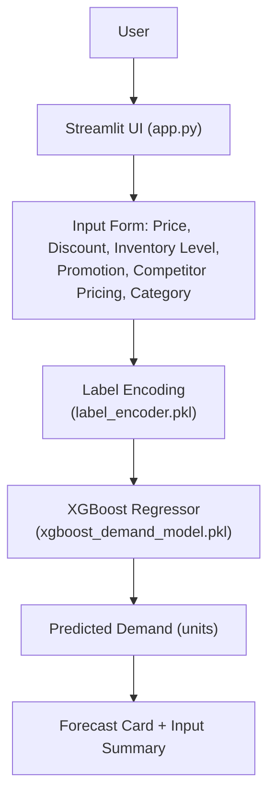
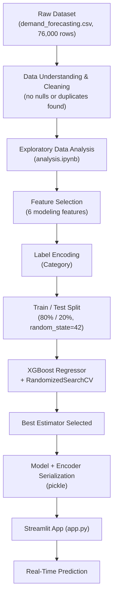
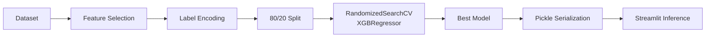

# 📊 Demand Forecasting System

> Predicts product demand from pricing, promotion, inventory and competitor-pricing signals using a tuned XGBoost regressor, served through an interactive Streamlit app.

[](https://github.com/harshantla-cloud/DEMAND-FORECASTING-SYSTEM)
[](https://www.python.org/)
[](https://streamlit.io/)
[](https://xgboost.readthedocs.io/)
[](https://harsh-demand-forecasting.streamlit.app/)

Retailers routinely over- or under-stock products because demand is estimated by intuition rather than data. This project trains a gradient-boosted regression model on **76,000 historical sales records** and exposes it through a lightweight web app. A user enters price, discount, inventory level, promotion status, competitor price and category, and receives an instant demand forecast in units. It is built for retail and inventory-planning use cases and demonstrates an end-to-end ML workflow, from raw data to a working prediction interface.

---

## 🚀 Project Overview

| | |
|---|---|
| **Problem** | Inventory and pricing teams need a fast way to estimate units demanded under a given set of conditions (price, discount, promotion, competitor pricing). |
| **Solution** | A trained XGBoost regression model wrapped in a Streamlit form that returns a predicted demand figure in real time. |
| **Target Users** | Retail analysts, inventory planners and e-commerce teams evaluating pricing and promotion scenarios. |
| **Key Value** | Turns a static historical dataset into an interactive "what-if" tool: change the price or toggle a promotion and see the projected demand. |

---

## 🎯 Objectives

- Predict product demand (in units) from price, discount, inventory, promotion and competitor-pricing features
- Quantify which inputs drive demand (feature importance)
- Provide a no-code interface so non-technical users can generate a forecast
- Serialize the trained model and encoder for reuse without retraining

---

## ✨ Key Features

### Core Features
- Real-time demand prediction from six user-provided inputs
- Single-page workflow: enter values → click **Predict Demand** → view forecast

### ML/AI Features
- `XGBRegressor` tuned with `RandomizedSearchCV` (25 iterations, 3-fold cross-validation)
- Label-encoded handling of the `Category` feature, persisted alongside the model
- Feature-importance analysis showing which inputs most influence demand

### User Interface Features
- Streamlit app with a custom-styled background, sidebar summary and a highlighted forecast card
- Two-column input layout with input validation bounds (for example, discount limited to 0–100)
- Expandable "View prediction inputs" table to review what was submitted
- Predictions are rounded and clamped to non-negative integer units

### Engineering Features
- Model and encoder cached with `@st.cache_resource` so they load once per session
- Pickled artifacts loaded independently of the training notebooks
- Graceful error handling for missing artifacts and failed predictions
- Clear separation of data, notebooks, models and application code

---

## 🏗️ System Architecture


```mermaid
flowchart TD
    A[User] --> B["Streamlit UI (app.py)"]
    B --> C["Input Form: Price, Discount, Inventory Level,<br/>Promotion, Competitor Pricing, Category"]
    C --> D["Label Encoding<br/>(label_encoder.pkl)"]
    D --> E["XGBoost Regressor<br/>(xgboost_demand_model.pkl)"]
    E --> F["Predicted Demand (units)"]
    F --> G["Forecast Card + Input Summary"]
```

| Component | Role |
|---|---|
| **Streamlit UI** | Collects six inputs across two columns and triggers prediction (`app.py`). |
| **Label Encoding** | Applies the saved encoder to `Category`, loaded from `models/label_encoder.pkl`. |
| **XGBoost Regressor** | Pre-trained model loaded from `models/xgboost_demand_model.pkl`; produces the prediction. |
| **Result Card** | Displays the forecast as "N Units" with a summary of the submitted inputs. |

---

## 🔄 Project Workflow


```mermaid
flowchart TD
    A["Raw Dataset<br/>(demand_forecasting.csv, 76,000 rows)"] --> B["Data Understanding & Cleaning<br/>(no nulls or duplicates found)"]
    B --> C["Exploratory Data Analysis<br/>(analysis.ipynb)"]
    C --> D["Feature Selection<br/>(6 modeling features)"]
    D --> E["Label Encoding<br/>(Category)"]
    E --> F["Train / Test Split<br/>(80% / 20%, random_state=42)"]
    F --> G["XGBoost Regressor<br/>+ RandomizedSearchCV"]
    G --> H["Best Estimator Selected"]
    H --> I["Model + Encoder Serialization<br/>(pickle)"]
    I --> J["Streamlit App (app.py)"]
    J --> K["Real-Time Prediction"]
```

> The EDA notebook also engineers exploratory fields (`Year`, `Month`, `Day`, `Weekday`, `Discounted Price`, `Sell Through Rate`) for analysis and charting. The final model uses only the six features listed below.

---

## 🧠 Machine Learning Pipeline


```mermaid
flowchart LR
    A[Dataset] --> B[Feature Selection]
    B --> C[Label Encoding]
    C --> D[80/20 Split]
    D --> E[RandomizedSearchCV<br/>XGBRegressor]
    E --> F[Best Model]
    F --> G[Pickle Serialization]
    G --> H[Streamlit Inference]
```

| Stage | Details |
|---|---|
| **Dataset** | `data/demand_forecasting.csv`: 76,000 rows, 16 columns (Date, Store ID, Product ID, Category, Region, Inventory Level, Units Sold, Units Ordered, Price, Discount, Weather Condition, Promotion, Competitor Pricing, Seasonality, Epidemic, Demand) |
| **Modeling features (6)** | `Price`, `Discount`, `Inventory Level`, `Promotion`, `Competitor Pricing`, `Category` |
| **Target** | `Demand` |
| **Preprocessing** | Checked for nulls and duplicates (none found) |
| **Encoding** | `LabelEncoder` on the single categorical feature, `Category` |
| **Train/Test split** | 80% / 20%, `random_state=42` |
| **Model** | `XGBRegressor` (`objective='reg:squarederror'`) |
| **Hyperparameter search** | `RandomizedSearchCV`, 25 iterations, 3-fold CV, scored on negative MAE |
| **Evaluation** | RMSE code is present in the notebook but its output was not saved: **Not specified** |
| **Serialization** | `models/xgboost_demand_model.pkl`, `models/label_encoder.pkl` |
| **Prediction pipeline** | App rebuilds the six-column frame, applies the saved encoder, calls `model.predict()` |

**Best hyperparameters found**

| Hyperparameter | Value |
|---|---|
| `n_estimators` | 200 |
| `max_depth` | 6 |
| `learning_rate` | 0.1 |
| `subsample` | 1.0 |
| `colsample_bytree` | 0.7 |
| `min_child_weight` | 1 |

---

## 🤖 Models Used

| Model | Purpose | Tuning | Evaluation Metric | Result |
|---|---|---|---|---|
| XGBoost Regressor | Predict product demand (units) | `RandomizedSearchCV`, 25 iterations, 3-fold CV | RMSE (code present) | Not specified (not executed in notebook) |

Only one model family (XGBoost) was trained and tuned; the notebooks contain no comparison against alternative algorithms.

**Feature importance (trained model)**

| Feature | Importance |
|---|---|
| Promotion | 0.478 |
| Category | 0.294 |
| Price | 0.099 |
| Competitor Pricing | 0.060 |
| Discount | 0.047 |
| Inventory Level | 0.022 |

---

## 📊 Exploratory Data Analysis

Performed in `notebooks/analysis.ipynb`:

- **Dimensions:** 76,000 rows × 16 original columns
- **Data quality:** zero missing values, zero duplicate rows
- **Composition:** 5 stores, 20 products, 5 categories (`Groceries` most frequent), 4 regions, 4 weather conditions, 4 seasons
- **Category vs. demand:** `Groceries` has the highest total demand (3,677,684 units) and highest average demand per record (≈121); `Furniture` has the lowest average (≈74)
- **Promotion effect:** average demand rises from ≈95 units (no promotion) to ≈123 units (promotion active)
- **Seasonality:** average demand is highest in Summer across all four regions
- **Other charts in the notebook:** demand distribution, inventory vs. units sold, demand by category and weather, monthly and daily trends, discounted price vs. demand (rendered inline in the notebook; not exported as image files)

---

## 🖥️ Application Preview

### Home / Input Interface


Two-column form for price, discount, inventory level, promotion, competitor price and category.

### Prediction Result


Forecasted demand appears as a highlighted card once **Predict Demand** is clicked.

> **Note:** `assets/Project Image/` contains conceptual presentation graphics that illustrate a broader system than what is implemented here, so they are intentionally not used as documentation of the current codebase.

---

## 📈 Results

- **Dominant predictors:** Promotion and Category together account for roughly 77% of total feature importance; pricing and inventory fields have a comparatively smaller effect.
- **Promotion uplift:** EDA shows about 29% higher average demand when a promotion is active, consistent with the model's learned importances.
- **Held-out accuracy:** an RMSE calculation is scaffolded in the training notebook but its output was not captured, so no test-set accuracy figure is reported.

---

## 🛠️ Tech Stack

| Category | Technology |
|---|---|
| Language | Python |
| Data Processing | Pandas, NumPy |
| Visualization (notebooks) | Matplotlib, Seaborn |
| Machine Learning | Scikit-learn, XGBoost |
| Frontend / App | Streamlit |
| Model Serialization | Pickle |
| Version Control | Git / GitHub |

---

## 📁 Project Structure

```
DEMAND-FORECASTING-SYSTEM/
│
├── assets/
│   ├── App Dashboard.jpeg
│   ├── Prediction by model.jpeg
│   ├── background.png
│   └── Project Image/
│       ├── 3D Explanation Model.jpeg
│       ├── Blue Print of Model.jpeg
│       ├── Brielfly Expalin Model.jpeg
│       └── Feature Importance.jpeg
│
├── data/
│   ├── demand_forecasting.csv
│   └── preprocessed_demand_forcasting_data.csv
│
├── models/
│   ├── label_encoder.pkl
│   └── xgboost_demand_model.pkl
│
├── notebooks/
│   ├── analysis.ipynb            # EDA, cleaning, feature engineering
│   └── machine_learning.ipynb    # Feature selection, training, tuning
│
├── app.py                        # Streamlit application
├── requirements.txt
└── README.md
```

| File | Purpose |
|---|---|
| `app.py` | Loads the serialized model and encoder and serves the prediction interface |
| `notebooks/analysis.ipynb` | Data cleaning and exploratory analysis |
| `notebooks/machine_learning.ipynb` | Feature selection, split, training and hyperparameter tuning |
| `models/` | Artifacts consumed directly by `app.py` |
| `requirements.txt` | `streamlit`, `pandas`, `numpy`, `scikit-learn`, `xgboost` |

---

## ⚙️ Installation & Setup

### 1. Clone the repository

```bash
git clone https://github.com/harshantla-cloud/DEMAND-FORECASTING-SYSTEM.git
cd DEMAND-FORECASTING-SYSTEM
```

### 2. Install dependencies

```bash
pip install -r requirements.txt
```

### 3. Run the application

```bash
streamlit run app.py
```

---

## ▶️ Usage

1. Enter the product **Price**
2. Enter the **Discount (%)**
3. Enter the **Inventory Level**
4. Select **Promotion** status (Active / No Promotion)
5. Enter the **Competitor Price**
6. Select the product **Category**
7. Click **🔮 Predict Demand**
8. Read the forecasted demand in units

---

## 🔮 Future Improvements

- Capture and report held-out metrics (RMSE, MAE, R²) for the trained model
- Add batch prediction via CSV upload
- Test whether the engineered time-based features (`Month`, `Weekday`, `Discounted Price`, `Sell Through Rate`) improve the model
- Compare XGBoost against alternative regressors to validate model selection
- Add automated tests and CI for the data and model pipeline

---

## 👤 Author

**Harsh** · B.Tech CSE (2023–2027) · Data Science, Machine Learning & AI

- GitHub: [harshantla-cloud](https://github.com/harshantla-cloud)
- LinkedIn: [linkedin.com/in/harsh-5694b13ab](https://www.linkedin.com/in/harsh-5694b13ab/)
- Live Demo: [harsh-demand-forecasting.streamlit.app](https://harsh-demand-forecasting.streamlit.app/)

---

⭐ If you found this project useful, consider giving it a star.
