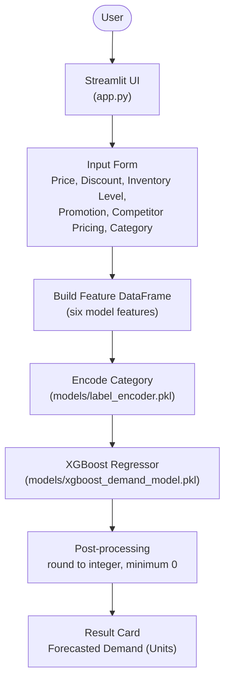
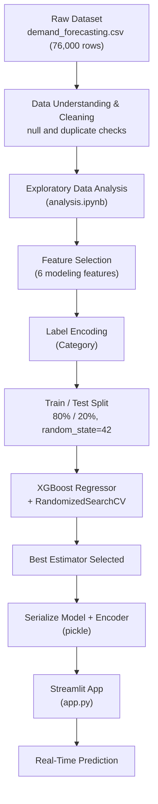
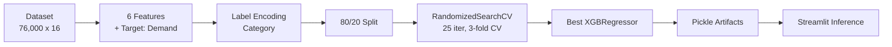

# 📈 Demand Forecasting System

> An XGBoost-based regression system that predicts product demand from pricing, promotion, inventory and competitor-pricing signals, served through an interactive Streamlit app.

[](https://github.com/harshantla-cloud/DEMAND-FORECASTING-SYSTEM)
[](https://www.python.org/)
[](https://streamlit.io/)
[](https://xgboost.readthedocs.io/)
[](#-machine-learning-pipeline)

**Live Demo:** [harsh-demand-forecasting.streamlit.app](https://harsh-demand-forecasting.streamlit.app/)

Retailers routinely over- or under-stock products because demand is estimated by intuition rather than data. This project trains a gradient-boosted regression model on **76,000 historical sales records** and exposes it through a lightweight web app. A user enters a product's price, discount, inventory level, promotion status, competitor price and category, and receives an instant demand estimate in units. It is built for retail and inventory-planning use cases and demonstrates an end-to-end ML workflow, from raw data to a working prediction interface.

---

## 🚀 Project Overview

| | |
|---|---|
| **Problem** | Inventory and pricing teams need a fast way to estimate how many units of a product will be demanded under a given set of conditions, without building a statistical model by hand. |
| **Solution** | A trained XGBoost regressor wrapped in a Streamlit form that returns a predicted demand figure in real time. |
| **Target Users** | Retail analysts, inventory planners and e-commerce teams evaluating pricing and promotion scenarios. |
| **Use Case** | "What-if" analysis: change the price, discount or promotion flag and see the projected demand. |
| **Key Value** | Turns a static historical dataset into an interactive decision-support tool. |

---

## 🎯 Objectives

- Predict product demand (in units) from price, discount, inventory, promotion and competitor-pricing features
- Quantify which inputs actually drive demand through feature-importance analysis
- Provide a no-code interface so non-technical users can generate a forecast
- Package the trained model and encoder as serialized artifacts so the app runs without retraining

---

## ✨ Key Features

### Core Features
- Real-time demand prediction from six user-provided inputs
- Single-page workflow: enter values → click **Predict Demand** → view result
- Expandable panel that echoes the exact inputs used for each prediction

### ML/AI Features
- XGBoost Regressor tuned with `RandomizedSearchCV` (25 candidate configurations, 3-fold cross-validation)
- Label-encoded handling of the `Category` feature, with the fitted encoder persisted alongside the model
- Feature-importance analysis identifying which inputs most influence demand

### User Interface Features
- Streamlit app with a custom dark theme, background image, sidebar summary and summary cards
- Two-column input layout and a highlighted result card showing the forecast in units
- Input widgets with sensible bounds (for example, discount limited to 0–100%)

### Engineering Features
- Model and encoder loaded once per session with `@st.cache_resource`
- Trained artifacts serialized with `pickle` and loaded independently of the training notebooks
- Graceful error handling around model loading and prediction
- Predictions rounded to whole units and floored at zero
- Clear separation of data, notebooks, models and application code

---

## 🏗️ System Architecture

The diagram reflects the runtime path implemented in `app.py`.


```mermaid
flowchart TD
    A([User]) --> B["Streamlit UI<br/>(app.py)"]
    B --> C["Input Form<br/>Price, Discount, Inventory Level,<br/>Promotion, Competitor Pricing, Category"]
    C --> D["Build Feature DataFrame<br/>(six model features)"]
    D --> E["Encode Category<br/>(models/label_encoder.pkl)"]
    E --> F["XGBoost Regressor<br/>(models/xgboost_demand_model.pkl)"]
    F --> G["Post-processing<br/>round to integer, minimum 0"]
    G --> H["Result Card<br/>Forecasted Demand (Units)"]
```

**Components**

- **Streamlit UI**: collects six inputs across two columns and renders the result card.
- **Feature DataFrame**: rebuilds the exact column structure the model was trained on.
- **Encoder**: the saved encoder object is loaded from `models/label_encoder.pkl`, and the app applies it to `Category` before prediction.
- **XGBoost Regressor**: the pre-trained model in `models/xgboost_demand_model.pkl` produces the prediction.
- **Post-processing**: the raw output is rounded to a whole number and clipped at zero before display.

---

## 🔄 Project Workflow

End-to-end sequence across `notebooks/analysis.ipynb`, `notebooks/machine_learning.ipynb` and the application.


```mermaid
flowchart TD
    A["Raw Dataset<br/>demand_forecasting.csv (76,000 rows)"] --> B["Data Understanding & Cleaning<br/>null and duplicate checks"]
    B --> C["Exploratory Data Analysis<br/>(analysis.ipynb)"]
    C --> D["Feature Selection<br/>(6 modeling features)"]
    D --> E["Label Encoding<br/>(Category)"]
    E --> F["Train / Test Split<br/>80% / 20%, random_state=42"]
    F --> G["XGBoost Regressor<br/>+ RandomizedSearchCV"]
    G --> H["Best Estimator Selected"]
    H --> I["Serialize Model + Encoder<br/>(pickle)"]
    I --> J["Streamlit App<br/>(app.py)"]
    J --> K["Real-Time Prediction"]
```

> The EDA notebook also engineers exploratory features (`Year`, `Month`, `Day`, `Weekday`, `Discounted Price`, `Sell Through Rate`) for analysis and charting. The final model does **not** consume them.

---

## 🧠 Machine Learning Pipeline


```mermaid
flowchart LR
    A["Dataset<br/>76,000 x 16"] --> B["6 Features<br/>+ Target: Demand"]
    B --> C["Label Encoding<br/>Category"]
    C --> D["80/20 Split"]
    D --> E["RandomizedSearchCV<br/>25 iter, 3-fold CV"]
    E --> F["Best XGBRegressor"]
    F --> G["Pickle Artifacts"]
    G --> H["Streamlit Inference"]
```

| Stage | Detail |
|---|---|
| **Dataset** | `data/demand_forecasting.csv`: 76,000 rows, 16 original columns (Date, Store ID, Product ID, Category, Region, Inventory Level, Units Sold, Units Ordered, Price, Discount, Weather Condition, Promotion, Competitor Pricing, Seasonality, Epidemic, Demand) |
| **Features (6)** | `Price`, `Discount`, `Inventory Level`, `Promotion`, `Competitor Pricing`, `Category` |
| **Target** | `Demand` |
| **Preprocessing** | Checked for nulls and duplicates (none found) |
| **Encoding** | Label encoding on the single categorical feature, `Category` |
| **Train/Test Split** | 80% / 20%, `random_state=42` |
| **Model** | `XGBRegressor` (`objective='reg:squarederror'`) |
| **Tuning** | `RandomizedSearchCV`, 25 iterations, 3-fold CV, scored on negative MAE |
| **Evaluation** | Not specified (see [Results](#-results)) |
| **Serialization** | `models/xgboost_demand_model.pkl`, `models/label_encoder.pkl` |
| **Prediction** | App rebuilds the six-column input, applies the saved encoder, calls `model.predict()` |

**Best hyperparameters found**

| Hyperparameter | Value |
|---|---|
| `n_estimators` | 200 |
| `max_depth` | 6 |
| `learning_rate` | 0.1 |
| `subsample` | 1.0 |
| `colsample_bytree` | 0.7 |
| `min_child_weight` | 1 |

---

## 🤖 Models Used

| Model | Purpose | Tuning | Evaluation Metric | Result |
|---|---|---|---|---|
| XGBoost Regressor (`XGBRegressor`) | Predict product demand (units) | `RandomizedSearchCV`, 25 iterations, 3-fold CV | Not specified | Not specified |

Only one model family (XGBoost) was trained and tuned. No comparison against alternative algorithms is present in the project, so XGBoost is the final model by design rather than by benchmarked selection.

**Feature importance (trained model)**

| Feature | Importance |
|---|---|
| Promotion | 0.478 |
| Category | 0.294 |
| Price | 0.099 |
| Competitor Pricing | 0.060 |
| Discount | 0.047 |
| Inventory Level | 0.022 |

---

## 📊 Exploratory Data Analysis

Performed in `notebooks/analysis.ipynb`:

- **Dimensions:** 76,000 rows × 16 original columns
- **Data quality:** zero missing values and zero duplicate rows
- **Categorical breakdown:** 5 stores, 20 products, 5 categories (`Groceries` most frequent), 4 regions, 4 weather conditions, 4 seasons
- **Category vs. demand:** `Groceries` has the highest total demand (3,677,684 units) and the highest average demand per record (about 121); `Furniture` has the lowest average (about 74)
- **Promotion effect:** average demand rises from about 95 units (no promotion) to about 123 units (promotion active)
- **Seasonality:** average demand is highest in Summer across all four regions
- **Charts in the notebook:** demand distribution, inventory vs. units sold, demand by category and weather condition, monthly and daily demand trends, discounted price vs. demand

Charts are rendered inline in the notebooks and are not exported as image files in the repository.

---

## 🖥️ Application Preview

### Home / Input Interface


Two-column form for price, discount, inventory level, promotion, competitor price and category.

### Prediction Result


Forecasted demand is shown in a result card after clicking **Predict Demand**.

---

## 📈 Results

- **Key demand drivers:** Promotion and Category together account for roughly 77% of total feature importance. Pricing and inventory fields contribute comparatively little.
- **Promotion uplift:** EDA shows about 29% higher average demand when a promotion is active (about 95 to about 123 units), consistent with the model's learned importances.
- **Model performance:** a held-out evaluation metric (RMSE) is scaffolded in the training notebook but its output was not saved, so **no accuracy figure is reported here**.
- **Scope note:** the model uses six tabular features and no date or time features. It estimates demand for a given scenario rather than projecting a time series into the future.

---

## 🛠️ Tech Stack

| Category | Technology |
|---|---|
| Language | Python |
| Data Processing | Pandas, NumPy |
| Visualization | Matplotlib, Seaborn |
| Machine Learning | Scikit-learn, XGBoost |
| Frontend / App | Streamlit |
| Model Serialization | Pickle |
| Version Control | Git / GitHub |

---

## 📁 Project Structure

```text
DEMAND-FORECASTING-SYSTEM/
│
├── assets/
│   ├── App Dashboard.jpeg
│   ├── Prediction by model.jpeg
│   ├── background.png
│   └── Project Image/                 # presentation graphics
│
├── data/
│   ├── demand_forecasting.csv
│   └── preprocessed_demand_forcasting_data.csv
│
├── models/
│   ├── label_encoder.pkl
│   └── xgboost_demand_model.pkl
│
├── notebooks/
│   ├── analysis.ipynb                 # EDA, cleaning, feature engineering
│   └── machine_learning.ipynb         # feature selection, training, tuning
│
├── app.py                             # Streamlit application
├── requirements.txt
├── .gitignore
└── README.md
```

| File | Purpose |
|---|---|
| `app.py` | Loads the serialized model and encoder and serves the prediction interface |
| `notebooks/analysis.ipynb` | Data cleaning and exploratory analysis |
| `notebooks/machine_learning.ipynb` | Feature selection, train/test split, training and hyperparameter tuning |
| `models/` | Artifacts consumed directly by `app.py` |

---

## ⚙️ Installation & Setup

### 1. Clone the repository

```bash
git clone https://github.com/harshantla-cloud/DEMAND-FORECASTING-SYSTEM.git
cd DEMAND-FORECASTING-SYSTEM
```

### 2. Install dependencies

```bash
pip install -r requirements.txt
```

### 3. Run the application

```bash
streamlit run app.py
```

The app opens at `http://localhost:8501`.

---

## ▶️ Usage

1. Enter the product **Price**
2. Enter the **Discount (%)**
3. Enter the **Inventory Level**
4. Select **Promotion** status (Active / No Promotion)
5. Enter the **Competitor Price**
6. Select the product **Category**
7. Click **🔮 Predict Demand**
8. Read the forecasted demand in units; expand **View prediction inputs** to review what was submitted

---

## 🔮 Future Improvements

- Capture and report held-out metrics (RMSE, MAE, R²) for the trained model
- Compare XGBoost against alternative regressors to validate model selection
- Test the engineered time-based features (`Month`, `Weekday`, `Discounted Price`, `Sell Through Rate`) for predictive value
- Add batch prediction through CSV upload
- Add automated tests and CI for the data and model pipeline

---

## 👤 Author

**Harsh** · B.Tech CSE (2023–2027) · Data Science, Machine Learning & AI

- GitHub: [harshantla-cloud](https://github.com/harshantla-cloud)
- LinkedIn: [harsh-5694b13ab](https://www.linkedin.com/in/harsh-5694b13ab/)
- Live Demo: [harsh-demand-forecasting.streamlit.app](https://harsh-demand-forecasting.streamlit.app/)
