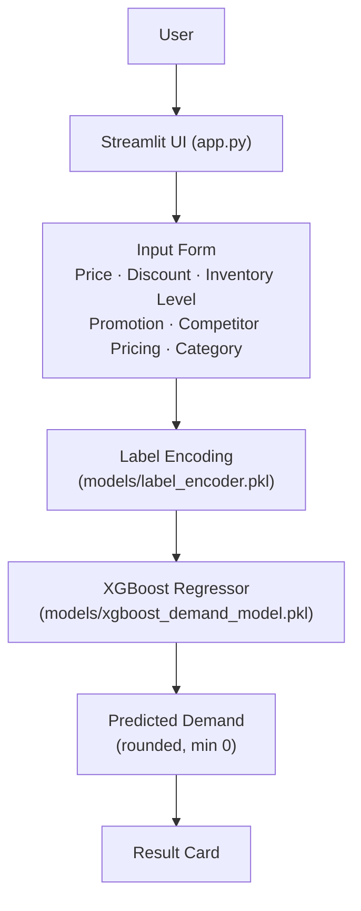
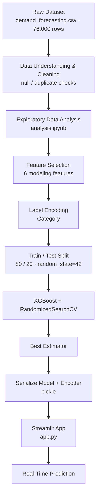
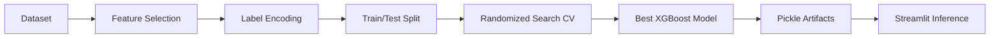

# 📊 Demand Forecasting System

> An XGBoost-based regression system that predicts product demand (in units) from pricing, promotion, inventory, and competitor-pricing signals, served through an interactive Streamlit application.

[](https://github.com/harshantla-cloud/DEMAND-FORECASTING-SYSTEM)
[](https://www.python.org/)
[](https://streamlit.io/)
[](https://xgboost.readthedocs.io/)
[](https://harsh-demand-forecasting.streamlit.app/)

Retailers often over- or under-stock products because demand is estimated by intuition rather than data. This project trains a gradient-boosted regression model on 76,000 historical sales records and exposes it through a lightweight web app: enter a product's price, discount, inventory level, promotion status, competitor price, and category, and receive an instant demand estimate. It is designed for retail analysts, inventory planners, and e-commerce teams evaluating pricing and promotion scenarios.

**🔗 [Live Demo](https://harsh-demand-forecasting.streamlit.app/)**

---

## 📑 Table of Contents

[Overview](#-project-overview) · [Objectives](#-objectives) · [Features](#-key-features) · [Architecture](#%EF%B8%8F-system-architecture) · [Workflow](#-project-workflow) · [ML Pipeline](#-machine-learning-pipeline) · [Model](#-model-used) · [EDA](#-exploratory-data-analysis) · [Preview](#%EF%B8%8F-application-preview) · [Results](#-results) · [Tech Stack](#%EF%B8%8F-tech-stack) · [Structure](#-project-structure) · [Setup](#%EF%B8%8F-installation--setup) · [Limitations](#-scope--limitations) · [Roadmap](#-future-improvements)

---

## 🚀 Project Overview

| | |
|---|---|
| **Problem** | Inventory and pricing teams need a fast way to estimate units of demand under a given set of conditions without building a model by hand. |
| **Solution** | A trained XGBoost regressor wrapped in a Streamlit form that returns a predicted demand figure in real time. |
| **Target Users** | Retail analysts, inventory planners, e-commerce teams. |
| **Use Case** | "What-if" analysis: change the price or toggle a promotion and immediately see the projected effect on demand. |
| **Value** | Turns a static historical dataset into an interactive decision-support tool. |

---

## 🎯 Objectives

- Predict product demand (units) from price, discount, inventory, promotion, and competitor-pricing features
- Identify which inputs drive demand most (feature importance)
- Provide a no-code interface so non-technical users can generate forecasts
- Package the trained model and encoder so predictions run without retraining

---

## ✨ Key Features

### Core Features
- Real-time demand prediction from six user-provided inputs
- Single-page workflow: enter values → click **Predict Demand** → view result
- Expandable panel that echoes the exact inputs used for each prediction

### ML Features
- XGBoost regressor tuned with `RandomizedSearchCV` (25 candidate configurations, 3-fold CV, scored on negative MAE)
- `LabelEncoder` for the `Category` feature, persisted alongside the model
- Feature-importance analysis of the trained model

### User Interface Features
- Custom-styled Streamlit interface: hero header, summary cards, sidebar with model details, two-column input form
- Result displayed as a prominent forecast card

### Engineering Features
- Model and encoder loaded once per session via `@st.cache_resource`
- Artifacts serialized with `pickle` and loaded independently of the training notebooks
- Category options in the UI are read from the saved encoder, so the app and model stay in sync
- Graceful error handling for artifact loading and prediction failures
- Predictions are clipped to non-negative whole units
- Clear separation of data, notebooks, models, and application code

---

## 🏗️ System Architecture

Reflects the runtime path implemented in `app.py`.


```mermaid
flowchart TD
    A[User] --> B["Streamlit UI (app.py)"]
    B --> C["Input Form<br/>Price · Discount · Inventory Level<br/>Promotion · Competitor Pricing · Category"]
    C --> D["Label Encoding<br/>(models/label_encoder.pkl)"]
    D --> E["XGBoost Regressor<br/>(models/xgboost_demand_model.pkl)"]
    E --> F["Predicted Demand<br/>(rounded, min 0)"]
    F --> G["Result Card"]
```

| Component | Role |
|---|---|
| **Streamlit UI** | Collects six inputs across two columns and renders the result. |
| **Label Encoding** | Transforms `Category` using the `LabelEncoder` fitted during training. |
| **XGBoost Regressor** | Pre-trained model that produces the prediction. |
| **Result Card** | Displays the forecast as "N Units". |

---

## 🔄 Project Workflow

Sequence across `notebooks/analysis.ipynb`, `notebooks/machine_learning.ipynb`, and `app.py`.


```mermaid
flowchart TD
    A["Raw Dataset<br/>demand_forecasting.csv · 76,000 rows"] --> B["Data Understanding & Cleaning<br/>null / duplicate checks"]
    B --> C["Exploratory Data Analysis<br/>analysis.ipynb"]
    C --> D["Feature Selection<br/>6 modeling features"]
    D --> E["Label Encoding<br/>Category"]
    E --> F["Train / Test Split<br/>80 / 20 · random_state=42"]
    F --> G["XGBoost + RandomizedSearchCV"]
    G --> H["Best Estimator"]
    H --> I["Serialize Model + Encoder<br/>pickle"]
    I --> J["Streamlit App<br/>app.py"]
    J --> K["Real-Time Prediction"]
```

> The EDA notebook also derives exploratory columns (`Year`, `Month`, `Day`, `Weekday`, `Discounted Price`, `Sell Through Rate`) for analysis and charting. The final model does **not** use them.

---

## 🧠 Machine Learning Pipeline


```mermaid
flowchart LR
    A[Dataset] --> B[Feature Selection] --> C[Label Encoding] --> D[Train/Test Split] --> E[Randomized Search CV] --> F[Best XGBoost Model] --> G[Pickle Artifacts] --> H[Streamlit Inference]
```

| Stage | Detail |
|---|---|
| **Dataset** | `data/demand_forecasting.csv` — 76,000 rows × 16 columns (Date, Store ID, Product ID, Category, Region, Inventory Level, Units Sold, Units Ordered, Price, Discount, Weather Condition, Promotion, Competitor Pricing, Seasonality, Epidemic, Demand). Source: Not specified. |
| **Features (6)** | `Price`, `Discount`, `Inventory Level`, `Promotion`, `Competitor Pricing`, `Category` |
| **Target** | `Demand` |
| **Preprocessing** | Checked for nulls and duplicates (none found) |
| **Encoding** | `LabelEncoder` on `Category` |
| **Split** | 80% train / 20% test, `random_state=42` |
| **Model** | `XGBRegressor` (`objective='reg:squarederror'`) |
| **Tuning** | `RandomizedSearchCV` — 25 iterations, 3-fold CV, negative MAE scoring |
| **Serialization** | `models/xgboost_demand_model.pkl`, `models/label_encoder.pkl` |
| **Inference** | App builds the same six-column frame, applies the saved encoder, calls `model.predict()` |

**Best hyperparameters found**

| Parameter | Value |
|---|---|
| `n_estimators` | 200 |
| `max_depth` | 6 |
| `learning_rate` | 0.1 |
| `subsample` | 1.0 |
| `colsample_bytree` | 0.7 |
| `min_child_weight` | 1 |

---

## 🤖 Model Used

| Model | Purpose | Tuning | Evaluation Metric | Result |
|---|---|---|---|---|
| XGBoost Regressor | Predict product demand (units) | `RandomizedSearchCV`, 25 iter., 3-fold CV | RMSE (code present) | Not specified — output not saved in notebook |

Only one model family was trained; no comparison against other algorithms is present in the project.

**Feature importance (trained model)**

| Feature | Importance |
|---|---|
| Promotion | 0.478 |
| Category | 0.294 |
| Price | 0.099 |
| Competitor Pricing | 0.060 |
| Discount | 0.047 |
| Inventory Level | 0.022 |

---

## 📊 Exploratory Data Analysis

Performed in `notebooks/analysis.ipynb`:

- **Dimensions:** 76,000 rows × 16 columns
- **Data quality:** 0 missing values, 0 duplicate rows
- **Cardinality:** 5 stores, 20 products, 5 categories (`Groceries` most frequent), 4 regions, 4 weather conditions, 4 seasons
- **Category vs. demand:** `Groceries` has the highest total demand (3,677,684 units) and highest average per record (≈121); `Furniture` has the lowest average (≈74)
- **Promotion effect:** average demand ≈95 units without promotion vs. ≈123 with promotion (≈29% uplift)
- **Seasonality:** average demand is highest in Summer across all four regions
- **Other analyses:** demand distribution, inventory vs. units sold, demand by category and weather, monthly/daily trends, discounted price vs. demand (rendered inline in the notebook; not exported as image files)

---

## 🖥️ Application Preview

### Home / Input Interface


*Two-column form for price, discount, inventory level, promotion, competitor price, and category.*

### Prediction Result


*Forecasted demand shown as a result card after clicking **Predict Demand**.*

---

## 📈 Results

- **Key demand drivers:** Promotion and Category together account for ~77% of total feature importance; price- and inventory-related fields contribute comparatively less.
- **EDA consistency:** the ≈29% promotion uplift and category-level demand gaps in the raw data agree with the model's learned importances.
- **Held-out accuracy:** an RMSE calculation exists in the training notebook but its output was not saved, so no test-set error is reported here. Adding it is the top item on the [roadmap](#-future-improvements).

---

## 🛠️ Tech Stack

| Category | Technology |
|---|---|
| Language | Python |
| Data Processing | Pandas, NumPy |
| Visualization | Matplotlib, Seaborn *(notebooks)* |
| Machine Learning | Scikit-learn, XGBoost |
| Frontend / App | Streamlit |
| Model Serialization | Pickle |
| Deployment | Streamlit (live demo link above) |
| Version Control | Git / GitHub |

---

## 📁 Project Structure

```
DEMAND-FORECASTING-SYSTEM/
│
├── assets/
│   ├── App Dashboard.jpeg
│   ├── Prediction by model.jpeg
│   ├── background.png
│   └── Project Image/              # presentation graphics
│
├── data/
│   ├── demand_forecasting.csv
│   └── preprocessed_demand_forcasting_data.csv
│
├── models/
│   ├── label_encoder.pkl
│   └── xgboost_demand_model.pkl
│
├── notebooks/
│   ├── analysis.ipynb              # EDA, cleaning, feature engineering
│   └── machine_learning.ipynb      # feature selection, training, tuning
│
├── app.py                          # Streamlit application
├── requirements.txt
└── README.md
```

| File | Purpose |
|---|---|
| `app.py` | Loads serialized artifacts and serves the prediction interface |
| `notebooks/analysis.ipynb` | Data cleaning and exploratory analysis |
| `notebooks/machine_learning.ipynb` | Feature selection, split, training, hyperparameter tuning |
| `models/` | Artifacts consumed directly by `app.py` |

---

## ⚙️ Installation & Setup

**1. Clone the repository**
```bash
git clone https://github.com/harshantla-cloud/DEMAND-FORECASTING-SYSTEM.git
cd DEMAND-FORECASTING-SYSTEM
```

**2. (Recommended) Create a virtual environment**
```bash
python -m venv venv
source venv/bin/activate      # Windows: venv\Scripts\activate
```

**3. Install dependencies**
```bash
pip install -r requirements.txt
```

**4. Run the application**
```bash
streamlit run app.py
```

The app opens at `http://localhost:8501`.

---

## ▶️ Usage

1. Enter the product **Price**
2. Enter the **Discount (%)**
3. Enter the **Inventory Level**
4. Select **Promotion** status (Active / No Promotion)
5. Enter the **Competitor Price**
6. Select the product **Category**
7. Click **🔮 Predict Demand** and read the forecast in units

---

## ⚠️ Scope & Limitations

- The model is a **tabular regression** on price, promotion, and category signals. It does not take a date or time-series history as input, so it estimates demand under given conditions rather than forecasting future periods.
- No held-out test metric is recorded yet (see Results).
- Only XGBoost was evaluated; no baseline or alternative-model comparison.
- Model artifacts are `pickle` files; load only artifacts you trust, and pin the `xgboost`/`scikit-learn` versions used for training when reproducing results.

---

## 🔮 Future Improvements

- Record and report held-out metrics (RMSE, MAE, R²) and compare against a simple baseline
- Compare XGBoost with alternative regressors to validate model selection
- Test whether the engineered time-based features (`Month`, `Weekday`, `Discounted Price`, `Sell Through Rate`) improve accuracy
- Add batch prediction via CSV upload
- Pin dependency versions in `requirements.txt`; add automated tests and CI

---

## 👤 Author

**Harsh** — B.Tech CSE (2023–2027) · Data Science, Machine Learning & AI

- GitHub: [harshantla-cloud](https://github.com/harshantla-cloud)
- LinkedIn: [linkedin.com/in/harsh-5694b13ab](https://www.linkedin.com/in/harsh-5694b13ab/)
- Live Demo: [harsh-demand-forecasting.streamlit.app](https://harsh-demand-forecasting.streamlit.app/)

---

⭐ If you found this project useful, consider giving it a star.
